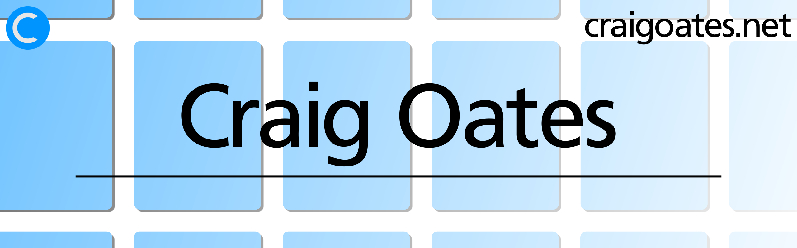

# About Me

I am a disciplined self-taught programmer, with experience developing programs
for web and dabbled with Windows desktop (WPF and UWP).

Alongside programming, I make art, write blogs and dabble with 3D printing and
CAD modelling. I, also, host my own Gitea instance alongside my website to
develop my software projects. I use GitHub to mirror my repositories, making
them more accessible to others. You can find these on my websites at:

- [craigoates.net](https://www.craigoates.net)
- [craigoates.net/software](https://www.craigoates.net/software) (Software Projects)
- [git.abbether.net](https://git.abbether.net/craig.oates) (Gitea Instance)

# What I'm Working On

I'm currently completing the CoGrammar Software Fundamentals Bootcamp. The main
language used throughout the course is Python.

With being self-taught, I'm using this Bootcamp to round out my knowledge,
regarding Software Development and build out my network. Speaking of which… If
you would like to get in touch and talk about working together, use the links in
the [Contact](#contact-me) section below.

If you would like to know more about CoGrammar and the Bootcamps they offer at,
use the following link:

- [CoGrammar Bootcamps](https://skills.cogrammar.com/)

# Technologies in my Tool Box

Below is a *non-exhaustive* list of technologies I've used to varying degree
over the years. As a general rule, I tend to stick to Linux (Debian-based) and
FLOSS tools, for personal stuff. Having said that, I'm comfortable working with
whatever technologies the project requires, when working with and for others.

| Technology            | Notes                                                                                                                            | Project of Interest                                                                         |
|:----------------------|:---------------------------------------------------------------------------------------------------------------------------------|:--------------------------------------------------------------------------------------------|
| Python                | Okay knowledge, don't use it enough to be fluent in it.                                                                          | [Return to Ritherdon](https://git.abbether.net/return-to-ritherdon)                         |
| Common Lisp           | Completed several personal projects with it. Experience running it in professional environment.                                  | [Ritherdon Archive](https://git.abbether.net/return-to-ritherdon/ritherdon-archive)         |
| Bash                  | I tried to learn PowerShell first, but Bash is what stuck.                                                                       |                                                                                             |
| Linux (Debian-based)  | My all-rounder, aim to do all types of work using Debian (software and non-software related).                                    |                                                                                             |
| Windows               | Can use as all-rounder, but tend to stick to programming these days. I use for Windows-only software.                            |                                                                                             |
| Mac OS                | Was my main OS at one point, but moved away from it. Knowledge is rusty.                                                         |                                                                                             |
| Digital Ocean         | Experience setting up and maintaining VM's (a.k.a. droplets).                                                                    |                                                                                             |
| Microsoft Azure       | Experience has dwindled, was my default choice in the past. Used PaaS features mostly (MS SQL Server, Blob Storage etc.)         |                                                                                             |
| AWS                   | Experience setting up and maintaining VM's.                                                                                      |                                                                                             |
| C# (.Net & .Net Core) | Experience dwindled, was my main language in the past. Will need to brush up on latest .Net (formerly *Core* stuff)              | [Console.Waterworks](https://git.abbether.net/craig.oates/console.waterworks)               |
| F# (.Net & .Net Core) | Solid foundation but experience dwindled. Will need to brush up like C#.                                                         | [Death Socket](https://git.abbether.net/craig.oates/death-socket)                           |
| Java                  | First programming language I learned. Foundation remains but will need to brush up on latest features and libraries/frameworks.  |                                                                                             |
| PHP                   | Used for early paid work (i.e. WordPress themes). Experience dwindled and avoid if possible. Mostly used now for basic websites. | [The Bus Yard](https://thebusyard.co.uk/)                                                   |
| WPF & UWP             | Prefer WPF, but experience with both has dwindled. Would like to focus on WPF if future projects are Windows desktop related.    | [Paint Grid](https://www.craigoates.net/software/view/paint-grid) (WPF program)             |
| SQLite                | My default option for personal projects.                                                                                         |                                                                                             |
| PostgreSQL            | Basic knowledge. I typically follow tutorials as I don't use it enough to remember the syntax fluently.                          |                                                                                             |
| MySQL/MariaDB         | Basic knowledge. Same as PostgreSQL.                                                                                             |                                                                                             |
| Unity                 | Atrophied at this point. The basics remain but it would take a while to get back up and running.                                 | [Amazing Animal Alphabet](https://www.craigoates.net/software/view/amazing-animal-alphabet) |

I originally came from a Fine Art background – even got a degree in it. This
means I've built up a set of skills on the graphic/visual design side of the
software development process. One of the benefits of this is I am reasonably
good at translating between the two teams (software developers and GUI
designers/illustrators etc.) and providing support in each discipline.

During my uni. days, I would use the Adobe stuff almost exclusively (Photoshop,
Illustrator, InDesign etc.), but I tend to stick to FLOSS programs these
days. So, programs like Inkscape, Krita and FreeCAD tend to be my first choice
these days. The same applies to Microsoft Office. I was brought up on that
tech. stack, but I now lean towards LibreOffice or anything which works with
open standard file formats.

# Contact Me

- Email: [craig@craigoates.net](mailto:craig@craigoates.net)
- LinkedIn: [in/craig-oates-8710b02b4/](https://www.linkedin.com/in/craig-oates-8710b02b4/)
- Mastodon: [@craig_oates@mastodon.social](https://mastodon.social/@craig_oates)
